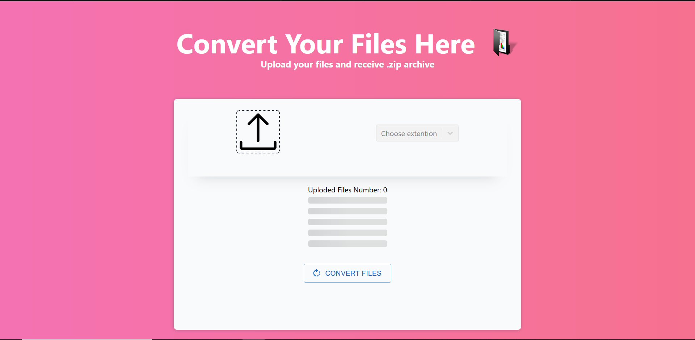

# Convertation App V1.0
Convertation App allows you to convert few files and receive them back in .zip file.
You can convertate as video files as photos. [FFFmpeg](https://www.npmjs.com/package/@ffmpeg/core) library was used to change files extention.
You need to choose files that ypu want to convert, choose extantion, press "convertation button".

## Life Demo


## Main Page 


Main screen of website contain upload button, selecter of file extantions and convertation button.
Extantion of source file is defined automaticaly by app.


## Loading Page


## Library usage:
* [ReactJS](https://react.dev/)
* [@ffmpeg/core](https://www.npmjs.com/package/@ffmpeg/core)
* [TailWindCSS](https://tailwindcss.com/)
* [@mui](https://mui.com/)


### Running  

To run this project, install it locally cloning repo, than using npm:
```
> cd ./my-app
> npm install
> npm start
```

### Version:
* V1.0 [Current]
